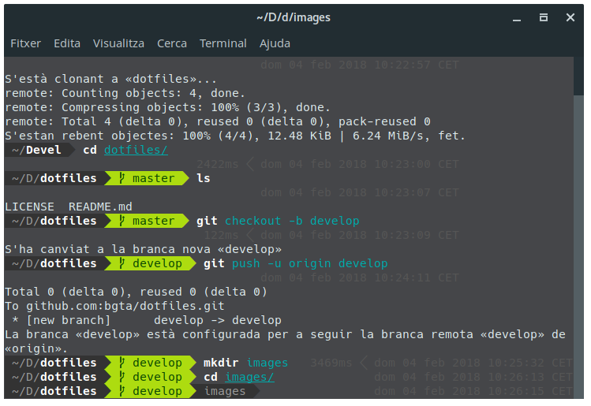

# My dotfiles

This is my dotfiles repo. Inspired in [Esteve Aguilera dotfiles repo](https://github.com/EsteveAguilera/dotfiles), I started playing with my dotfiles, and so why not share mine here too!?

## Fish

I'm using the [Fish shell](https://fishshell.com/) and [Fisherman](https://github.com/fisherman/fisherman) as a shell plugin manager.

The [fishfile](https://github.com/bgta/dotfiles/blob/master/fish/fishfile) contains a list of [Fisherman](https://github.com/fisherman/fisherman) plugins that I use.

The [flutter.fish](https://github.com/bgta/dotfiles/blob/develop/fish/flutter.fish) file contains a little fish script to set my [Flutter.io](https://flutter.io/) local installation in my PATH.